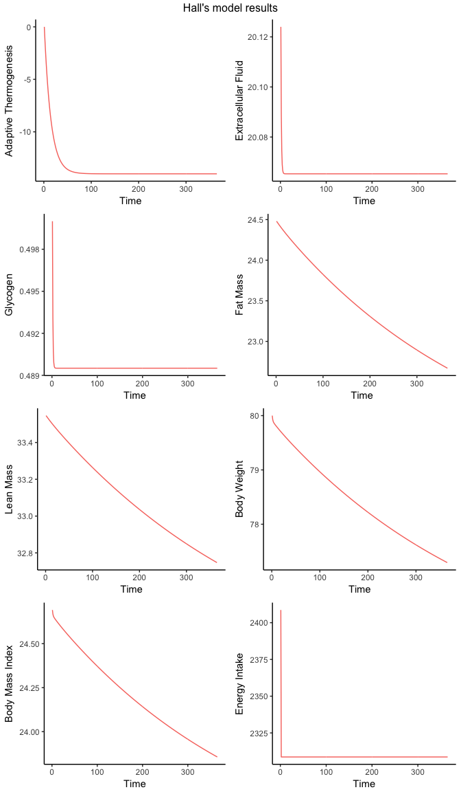
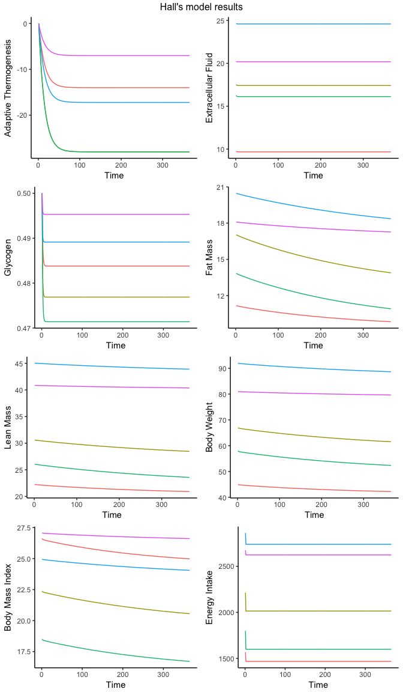
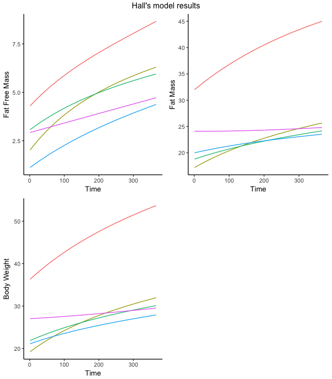

bw: Dynamic Body Weight Model
================

The `bw` package implements the [Dynamic Weight Change model from *Hall et al.* for adults](https://www.niddk.nih.gov/research-funding/at-niddk/labs-branches/LBM/integrative-physiology-section/research-behind-body-weight-planner/Documents/Hall_Lancet_Web_Appendix.pdf) and the [Children dynamic weight model from Hall **et al**](http://www.thelancet.com/journals/lancet/article/PIIS2213-8587(13)70051-2/abstract) for children.

Installation
------------

To install the latest version please run the following code:

``` r
if (!require(devtools)){install.packages("devtools")}
devtools::install_github("INSP-RH/bw")
```

Adult Model
-----------

The main function to estimate weight change is `adult_weight`. It takes as input body weight (kg), height (m), age (yrs), sex (either `"male"` or `"female"`) either as column vectors from a database or as individual level. In addition it takes a day-by-day `matrix` for change in energy intake from baseline (kcal/day) and another `matrix` for change in sodium (mg/day).

``` r
#Individual's parameters
bw  <- 80
ht  <- 1.8
age <- 32
sex <- "female"

#Matrix of energy intake change for 100 days
deltaEI     <- rep(-100, 365)

#Function of sodium intake
deltaNA     <- rep(-10, 365)

#Estimate weight change. 
wtrajectory  <- adult_weight(bw, ht, age, sex, deltaEI, deltaNA)
```

The variable `wtrajectory` is a list containing matrices of all the modelled variables:

``` r
names(wtrajectory)
```

    ##  [1] "Time"                   "Age"                   
    ##  [3] "Adaptive_Thermogenesis" "Extracellular_Fluid"   
    ##  [5] "Glycogen"               "Fat_Mass"              
    ##  [7] "Lean_Mass"              "Body_Weight"           
    ##  [9] "Body_Mass_Index"        "BMI_Category"          
    ## [11] "Energy_Intake"          "Correct_Values"

These can be plotted with `model_plot`:

``` r
model_plot(wtrajectory)
```



The model can also be used for computing weight change for several individuals at a time:

``` r
#Antropometric data
weights <- c(45, 67, 58, 92, 81)
heights <- c(1.30, 1.73, 1.77, 1.92, 1.73)
ages    <- c(45, 23, 66, 44, 23)
sexes   <- c("male", "female", "female", "male", "male") 

#Matrix of energy consumption reduction: 
EIchange <- rbind(rep(-100, 365), rep(-200, 365), rep(-200, 365), 
                  rep(-123, 365), rep(-50, 365))

#Returns a weight change matrix and other matrices
model_weight <- adult_weight(weights, heights, ages, sexes, 
                             EIchange)

model_plot(model_weight)
```



Average for included variables can be done:

``` r
model_mean(model_weight)
```

    ##   time               variable group     mean  SE_mean Lower_CI_mean
    ## 1    1                    Age     1 40.20000 8.046117      24.42990
    ## 2    1 Adaptive_Thermogenesis     1  0.00000 0.000000       0.00000
    ## 3    1    Extracellular_Fluid     1 17.68290 2.445504      12.88980
    ## 4    1               Glycogen     1  0.50000 0.000000       0.50000
    ## 5    1               Fat_Mass     1 16.11919 1.634683      12.91527
    ## 6    1              Lean_Mass     1 32.94791 4.340489      24.44071
    ##   Upper_CI_mean  variance SE_variance Lower_CI_variance Upper_CI_variance
    ## 1      55.97010 323.70000  148.838516         31.981870         615.41813
    ## 2       0.00000   0.00000    0.000000          0.000000           0.00000
    ## 3      22.47600  29.90246   16.471194         -2.380486          62.18541
    ## 4       0.50000   0.00000    0.000000          0.000000           0.00000
    ## 5      19.32311  13.36094    5.819498          1.954934          24.76695
    ## 6      41.45512  94.19923   31.078690         33.286112         155.11234

BMI prevalence can be computed:

``` r
adult_bmi(model_weight)
```

    ##   Day Group  BMI_Category Mean       2.5 %    97.5 %
    ## 1   1     1        Normal  0.6  0.11990883 1.0800912
    ## 2   1     1     Pre-Obese  0.4 -0.08009117 0.8800912
    ## 3   2     1 Mild Thinness  0.2 -0.19199280 0.5919928
    ## 4   2     1        Normal  0.4 -0.08009117 0.8800912
    ## 5   2     1     Pre-Obese  0.4 -0.08009117 0.8800912
    ## 6   2     1 Mild Thinness  0.2 -0.19199280 0.5919928

Children Model
--------------

The function `child_weight` estimates weight change the same way as `adult_weight`. It takes as input age (yrs), sex ("male" or "female"), fat free mass (kg), and fat mass (kg). The functions `model_mean` and `model_plot` can be also com A function of energy intake (kcals/yr) for all the years can be inputed.

``` r
#Antropometric data
FatFree <- c(32, 17.2, 18.8, 20, 24.1)
Fat     <- c(4.30, 2.02, 3.07, 1.12, 2.93)
ages    <- c(10, 6.2, 5.4, 4, 4.1)
sexes   <- c("male", "female", "female", "male", "male") 

#Returns a weight change matrix and other matrices
model_weight <- child_weight(ages, sexes, Fat, FatFree)

#Plot
model_plot(model_weight)
```



Mean by sex:

``` r
model_mean(model_weight, group = sexes)
```

    ##   time      variable  group      mean   SE_mean Lower_CI_mean
    ## 1    1           Age female  5.800000 0.3162278      5.180205
    ## 2    1           Age   male  6.033333 1.8107191      2.484389
    ## 3    1 Fat_Free_Mass female  2.545000 0.4150489      1.731519
    ## 4    1 Fat_Free_Mass   male  2.783333 0.8406732      1.135644
    ## 5    1      Fat_Mass female 18.000000 0.6324555     16.760410
    ## 6    1      Fat_Mass   male 25.366667 3.2146943     19.065982
    ##   Upper_CI_mean  variance  SE_variance Lower_CI_variance Upper_CI_variance
    ## 1      6.419795  0.320000 5.488310e-16         0.3200000          0.320000
    ## 2      9.582278 11.803333 5.387460e+00         1.2441059         22.362561
    ## 3      3.358481  0.551250 0.000000e+00         0.5512500          0.551250
    ## 4      4.431023  2.544233 1.161278e+00         0.2681696          4.820297
    ## 5     19.239590  1.280000 0.000000e+00         1.2800000          1.280000
    ## 6     31.667352 37.203333 1.698092e+01         3.9213403         70.485326

Additional information on usage can be found on the package's vignette:

``` r
browseVignettes("bw")
```
